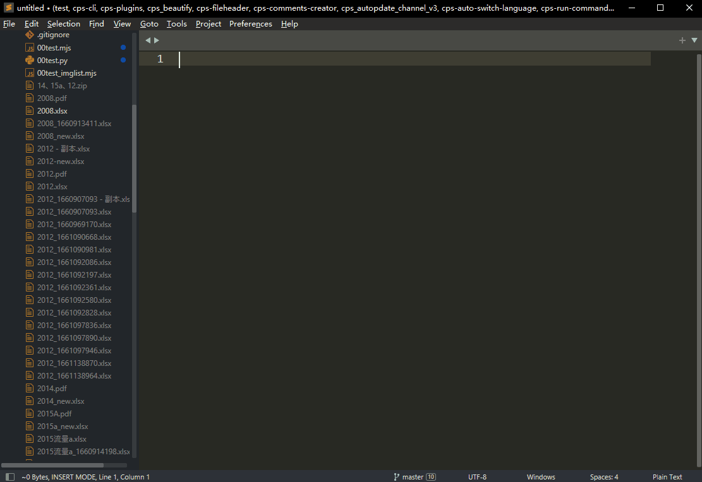

# 简介|Introductions

同类插件sublimeText已经有，但很久没更新，而且功能比较多，配置起来有点没弄明白，还是写个自己用，人蠢就多努力，没办法。

<div>
    
    
    
</div>


# 主要功能|Features

- 快速插入文件头部信息
- 根据后缀名关联模板
- 一种后缀名可关联多个模板（vue2和vue3）


# 使用|Usage

- `Alt  + f`在当前文件插入文件头，支持自定义模板和对应格式

使用演示：




# 插件配置|Configure

- `Packages/User/cps.sublime-settings`

```js
{
  "fileheader":{
    "update_header_on_openfile": false, //打开文件的时候是否检查需要更新头部信息
    "update_header_on_savefile": false, //保存时是否更新头部信息

    //本插件只通过后缀名来识别文件,请按需添加
    "template": {
      //模版插件目录/fileheader/header/*.tmpl
      // "文件格式":"对应的 xxxx.tmpl 文件",
      // 支持多个.tmpl文件
      ".bat": "Batch File",
      ".pug": "pug",
      ".js": "JavaScript",
      ".json": "JavaScript",
      ".cjs": "JavaScript", //comment.js 文件
      ".mjs": "JavaScript", //ES6文件
      ".ts": "JavaScript",
      ".css": "CSS",
      ".scss": "SCSS",
      ".less": "less",
      ".stylus": "styl",
      ".styl": "styl",
      ".vue": ["vue", "vue2", "vue3", "vue2-ts", "vue3-setup"],
      ".py": "Python"
    },

    "header_info": {
      "author": "CPS",
      "email": "373704015@qq.com",
      "create_time": "", // 输入一个时间格式 默认: "%Y-%m-%d %H:%M:%S" | "%Y-%m-%d" | "%H:%M:%S"
      "last_modified_by": "CPS", // 输入一个时间格式 默认: "%Y-%m-%d %H:%M:%S" | "%Y-%m-%d" | "%H:%M:%S"
      "last_modified_time": "", // 输入一个时间格式 默认: "%Y-%m-%d %H:%M:%S" | "%Y-%m-%d" | "%H:%M:%S"
      "project_name": "",
      "file_path": "",
      "file_name": "",
      "自定义": "{{自定义}}" //自定义要替换的信息
    }
  },
}
```

